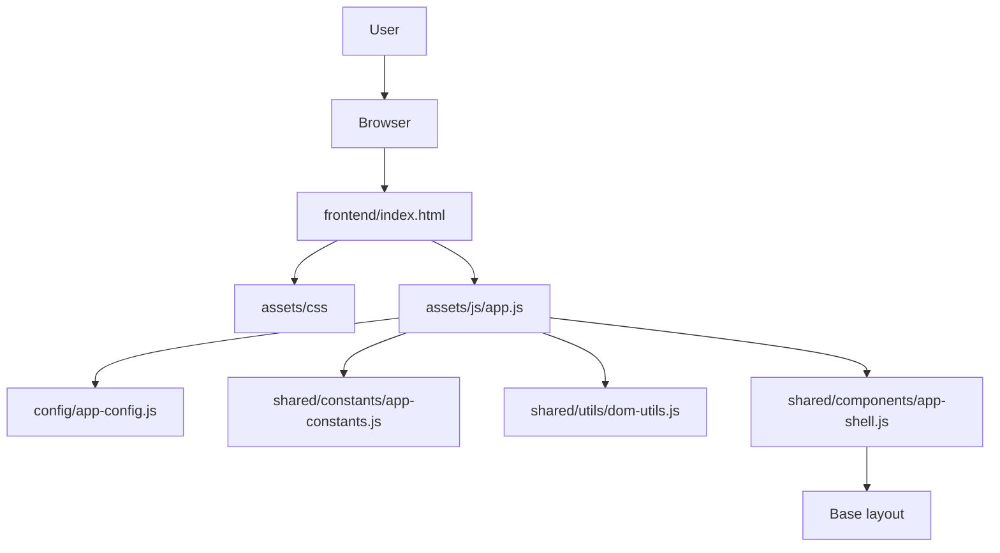

# Technical Design Document

## PB01 - Fundamentos del Producto y Estructura Base

## Objective

Create the minimum technical foundation for **Process Transformation AI** so the product can run locally from Visual Studio Code and support future Product Backlogs.

PB01 does not include business logic, persistence, Google Apps Script integration, Google Sheets, Google Drive, AI services, or analytical capabilities.

## Architecture

The solution is organized into separated areas:

- `frontend`
- `backend`
- `database`
- `docs`
- `drive`
- `tests`

The frontend uses HTML, CSS, and vanilla JavaScript. Backend folders are prepared for future Google Apps Script work.

## Component Diagram

## Data Model

PB01 does not implement a persistent data model.

Only local technical metadata is defined:

- app name
- version
- environment
- API base URL placeholder

## Flow

1. User opens `frontend/index.html`.
2. Browser loads CSS and JavaScript files.
3. `app.js` reads config and constants.
4. `app-shell.js` renders the base shell into `#app`.

## Dependencies

No external dependencies are required.

## Services

PB01 includes only frontend bootstrap helpers:

- `AppShell.render`
- `DomUtils.selectElement`
- `DomUtils.setHtml`

## Risks

- Adding functionality beyond PB01 scope.
- Creating accidental dependency on unavailable backend services.
- Over-designing the foundation before business modules are approved.

## Tests

- Open `frontend/index.html` locally.
- Verify UI renders.
- Verify CSS loads.
- Verify JavaScript initializes the shell.
- Verify folder structure exists.

